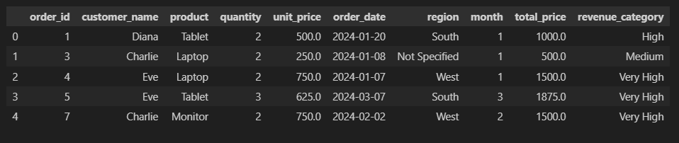
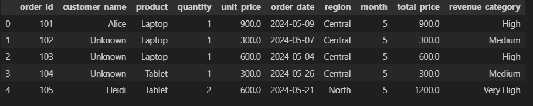
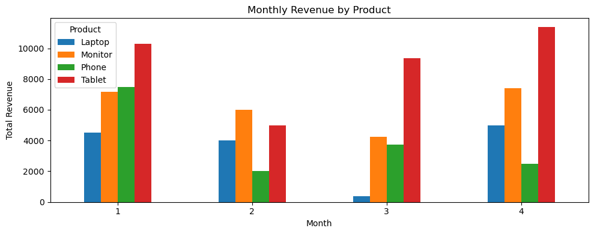
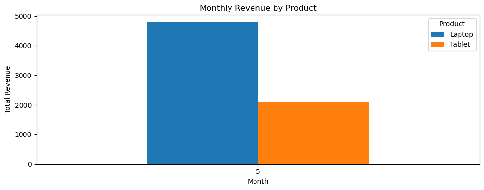

# *ETL Midterm – Snit_552*

## *Table of Contents*

- [*1. Project Overview*](#1-project-overview)  
- [*2. ETL Phases*](#2-etl-phases)  
  - [*Extraction: etl_extract.ipynb*](#1-extraction-etl_extractipynb)  
  - [*Transformation: etl_transform.ipynb*](#2-transformation--etl_transformipynb)  
  - [*Load: etl_load.ipynb*](#3-load)  
  - [Visualization](#4-visualization)  
- [*3. Repository Structure*](#3-repository-structure)  
- [*4. Tools Used*](#4-tools-used)  
- [*5. How to Reproduce*](#5how-to-reproduce)  
- [*6. Screenshoots of Data and Chart*](#6screenshoots_of_data_and_chart)  
- [*7. Repository URL & License*](#repository-url)


# *1. Project Overview*
## *ETL Lab Summary – Retail Data Pipeline*

*The primary objective of this project is to demonstrate a complete ETL (Extract, Transform, Load) pipeline for retail transaction data. The process involves extracting raw and incremental datasets, performing thorough data cleaning, transformation, and enrichment, and finally loading the cleaned data into an efficient, queryable format. The goal is to prepare the data for insightful analysis and visualization of sales trends across products and time.*


---
# *2. ETL Phases*
## *1. Extraction: etl_extract.ipynb*
*This project begins with the **Extract Phase**, where retail transaction data from two CSV files—`raw_data.csv` and `incremental_data.csv`—were imported and inspected using pandas.*

- *Source:* Raw retail data loaded from a CSV file.
- *Action:* Initial inspection using `.head()` and `.info()` to assess structure and missing values.

*- **Datasets:**   
  - `raw_data.csv`: 100 records × 7 columns  
  - `incremental_data.csv`: 10 records × 7 columns*

*- **Data Quality Insights:**  
  - Missing values detected in key columns including `customer_name`, `quantity`, `unit_price`, `order_date`, and `region`.  
  - One duplicate record found in `raw_data.csv`; none in `incremental_data.csv`.  
  - Data type inconsistencies identified (e.g., `order_date` stored as object instead of datetime).  
  - Numeric anomalies spotted, such as suspiciously low `unit_price` values.*

*- **Next Steps:**  
  - Both datasets have been saved in the `data/` directory and are ready for the transformation and analysis phases.*

---

## *2. Transformation : etl_transform.ipynb*

This phase involved a series of structured data cleaning, enrichment, and type conversion operations to prepare both the full and incremental datasets for analysis.

### *Data Cleaning and Imputation*

- Removed duplicate records to ensure data integrity.  
- Handled missing values strategically to maintain completeness and analytical accuracy:  
  - Filled missing `customer_name` values with `"Unknown"` to retain descriptive context.  
  - Imputed missing `order_date` entries with placeholder `'2025-01-01'` and converted the column to `datetime64`.  
  - Filled missing `region` values with `"Not Specified"` to preserve geographic dimension.  
- Applied contextual group-based imputation for `quantity` and `unit_price` using group means or medians based on `product`, `region`, and `month`.  
- Used a tiered fallback strategy to fill remaining missing values where some groups lacked sufficient data.

### *Structural Transformations & Data Type Conversion*
- *Converted fields such as `order_date`, `order_id`, and `product` to appropriate types.*

### *Data Enrichment: Computing `total_price`*
- **Action Taken:**  
  A new column `total_price` was created by multiplying `quantity` and `unit_price` for each record.

- **Reason:**  
  To capture revenue per transaction for further aggregation and categorization.

### *Categorizing `total_price` with Fixed Bins*
- **Method:**  
-  `total_price` was grouped into business-relevant tiers using `pd.cut()` with fixed numeric intervals.
-Categorized `total_price` into fixed bins—`Low`, `Medium`, `High`, `Very High`—using `pd.cut()` for meaningful business segmentation.


### *Output*

Both transformed datasets—full and incremental—were saved as `transformed_full.csv` and `transformed_incremental.csv` in the `data/` folder for downstream analysis.

This comprehensive transformation ensures the data is clean, complete, and enriched, ready for insightful analytics and reporting.


---
### *3. Load*
### *etl_load.ipynb – Data Loading*

**Purpose:** Save the final transformed datasets in a queryable and efficient format.

**Tasks Completed:**  
- *Loaded transformed datasets and saved them in Parquet format using `pandas.to_parquet()`.* 
- *Verified successful storage by previewing the first five rows with `pd.read_parquet(...).head()`.* 
- *Saved the outputs to the `loaded/` directory for future analysis.*
- *This ensures both efficient storage and faster querying for downstream analysis.*

### *4. Visualization:*

*Notebook: `Visualization.ipynb`*  
*Purpose: Visualize total revenue trends for both full and incremental datasets.*  

**Key Chart:**  
`monthly_revenue = transformed_full.groupby(['month', 'product'])['total_price'].sum().unstack(fill_value=0)`  
*This creates a month-by-product revenue matrix using `groupby()` + `unstack()`, ideal for bar chart plotting — a best practice for reshaping data in pandas.* 

*The notebook uses matplotlib to produce grouped bar charts that compare monthly revenue across products, providing clear insights into trends over time.* 


## *3. Repository Structure*
```plaintext
ETL_Midterm_Snit_552/                    # Root project directory
├── data/                               
│   ├── raw_data.csv                     # Full raw dataset
│   └── incremental_data.csv             # Incremental updates dataset
├── transformed/                  
│   ├── transformed_full.csv            # Transformed full dataset
│   └── transformed_incremental.csv     # Transformed incremental dataset
├── loaded/                       
│   ├── full_data.parquet               # Parquet file for full dataset
│   └── incremental_data.parquet        # Parquet file for incremental dataset
├── etl_extract.ipynb                   # Notebook for data extraction phase
├── etl_transform.ipynb                 # Notebook for data cleaning and transformation phase
├── etl_load.ipynb                      # Notebook for loading data into final format
├── Visualization.ipynb                 # Notebook for data visualization and analysis
├── README.md                           # Project documentation and instructions
└── .gitignore                          # Specifies files/folders to ignore in version control

```
## *4. Tools Used*  
- *Python & pandas   #Data manipulation, cleaning, transformation, and loading*

- *Jupyter Notebooks   #Interactive environment for building and documenting ETL*

- *Parquet (Snappy compression)  #Efficient columnar file format for storing transformed data*

## *5.How to Reproduce*

1. *Clone the repository:*

   ```bash
   git clone https://github.com/yourusername/DSA2040A_ETL_Midterm_Snit_123.git
   ```

2. *Navigate into the project directory:*

   ```bash
   cd DSA2040A_ETL_Midterm_Snit_123
   ```

3. *Install the required Python packages:*

   ```bash
   pip install pandas pyarrow matplotlib
   ```

4. *Run the ETL notebooks in sequence:*

   * *`etl_extract.ipynb`* 
   - *Reads the raw and incremental datasets (raw_data.csv and incremental_data.csv)*
   - *Extracts and saves raw data to `data/` folder.*
   * *`etl_transform.ipynb`* – *Cleans and transforms data; saves to `transformed/` folder.*
   * *`etl_load.ipynb`* – *Loads transformed data into Parquet format; saves to `loaded/` folder.*
   * *`Visualization.ipynb`* – *Generates visualizations of revenue trends.*

---

 ## *6.Screenshoots_of_Data_and_Chart* 
 ### *Screenshots of Data Tables*
 
*All transformed files will be saved in the*
- *`transformed/`*  
  - *`transformed_full.csv`: full cleaned dataset (91 rows × 10 columns)*  
  - *`transformed_incremental.csv`: incremental updates (9 rows × 10 columns)*  
- *Full Dataset Snapshot*


-  *incremetal_Dataset Snapshot*


- *`loaded/`*  
  - *`full_data.parquet`: Snappy‑compressed Parquet file for full dataset*  
  - *`incremental_data.parquet`: Snappy‑compressed Parquet file for incremental dataset*  


- *`Visualization.ipynb`: includes charts such as:*  
  • *Monthly revenue by product*  
  
  ### *Insights: Monthly Revenue by Product*

- *Tablets consistently generate the highest revenue across all months.*  
- *Phone sales decline after Month 1, indicating a downward trend.*  
- *Monitors show stable revenue performance throughout the period.*  
- *Laptop revenue fluctuates, dipping in Month 3 before recovering.*  

*These insights suggest focusing on tablet promotions, investigating the causes of phone sales decline, and maintaining current strategies for monitors.*


### *May Revenue Insights*

- *Laptops led revenue in May, followed by tablets.*  
- *Other products showed no sales during this period.*  

*Recommendations include continuing the effective laptop sales strategy, supporting tablets with targeted promotions, and investigating the absence of sales for other products.*


  ## *Repository URL*
[DSA2040A ETL Midterm Project Repository](https://github.com/SnitTeshome/DSA2040A_ETL_Midterm_Snit_552)

## *License*

This project is licensed under the [MIT License](LICENSE).


© 2025 Snit Kahsay Teshome


